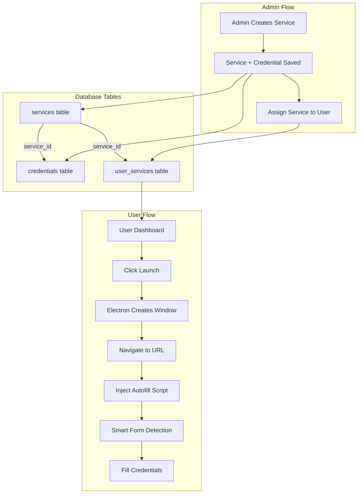

# Service + Credential + Autofill Implementation Plan

## Architecture Overview



---NOTE: YOU WILL USE MY MCP SERVEER SUPABSE TO RUN K MIGRATIONS YORUSLEF , MAKE SURE YOU FIRST READ ALL THEDATABS SCEMA , DONT DELLETE other schamas rather tahn your working enveiroamnent adn on which pahses youa re working it deoends on you to update ro dleete or edit only thosse databse fucnaios etc 

## Phase 1: Database and Backend (Foundation)

### Step 1.1: Database Migration - Services and Credentials Tables

Create new migration file: `backend/migrations/20251212_add_services_credentials.sql`

```sql
-- Services table
CREATE TABLE IF NOT EXISTS services (
    id UUID PRIMARY KEY DEFAULT uuid_generate_v4(),
    name VARCHAR(100) NOT NULL,
    url VARCHAR(500) NOT NULL,
    category VARCHAR(50),
    status VARCHAR(20) DEFAULT 'active',
    created_at TIMESTAMP WITH TIME ZONE DEFAULT NOW(),
    updated_at TIMESTAMP WITH TIME ZONE DEFAULT NOW()
);

-- Credentials table (linked to services)
CREATE TABLE IF NOT EXISTS credentials (
    id UUID PRIMARY KEY DEFAULT uuid_generate_v4(),
    service_id UUID NOT NULL REFERENCES services(id) ON DELETE CASCADE,
    username VARCHAR(255) NOT NULL,
    password_encrypted VARCHAR(500) NOT NULL,
    visibility VARCHAR(20) DEFAULT 'hidden',
    created_at TIMESTAMP WITH TIME ZONE DEFAULT NOW(),
    updated_at TIMESTAMP WITH TIME ZONE DEFAULT NOW()
);

-- User-Service assignments
CREATE TABLE IF NOT EXISTS user_services (
    id UUID PRIMARY KEY DEFAULT uuid_generate_v4(),
    user_id UUID NOT NULL REFERENCES users(id) ON DELETE CASCADE,
    service_id UUID NOT NULL REFERENCES services(id) ON DELETE CASCADE,
    assigned_by UUID REFERENCES users(id),
    assigned_at TIMESTAMP WITH TIME ZONE DEFAULT NOW(),
    UNIQUE(user_id, service_id)
);
```

### Step 1.2: Backend Routes - Services CRUD

Create/update: [`backend/src/routes/services_routes.py`](backend/src/routes/services_routes.py)

Endpoints needed:

- `GET /api/services` - List all services (admin)
- `POST /api/services` - Create service WITH credentials
- `PUT /api/services/{id}` - Update service
- `DELETE /api/services/{id}` - Delete service (cascades to credentials)
- `GET /api/services/user/{user_id}` - Get user's assigned services
- `POST /api/services/{service_id}/assign/{user_id}` - Assign service to user
- `DELETE /api/services/{service_id}/unassign/{user_id}` - Unassign service

### Step 1.3: Backend Routes - Credentials (Read-Only View)

Create: [`backend/src/routes/credentials_routes.py`](backend/src/routes/credentials_routes.py)

Endpoints:

- `GET /api/credentials` - List all credentials (admin view, linked to services)
- `GET /api/credentials/service/{service_id}` - Get credentials for a service
- `GET /api/credentials/launch/{service_id}` - Get decrypted credentials for autofill (internal use)

### Step 1.4: Password Encryption Utility

Create: [`backend/src/services/encryption_service.py`](backend/src/services/encryption_service.py)

- Use `cryptography` library with Fernet (AES-128)
- Functions: `encrypt_password(plain)`, `decrypt_password(encrypted)`
- Encryption key from environment variable

---

## Phase 2: Frontend Admin Updates

### Step 2.1: Update Services Form - Add Credential Fields

Modify: [`frontend/src/pages/admin/Services.jsx`](frontend/src/pages/admin/Services.jsx)

Update the "Add New Service" dialog to include:

- Service Name (existing)
- Service URL (existing)
- Category (existing)
- Status (existing)
- **NEW:** Username/Email field
- **NEW:** Password field
- **NEW:** Visibility dropdown (hidden/visible)

Form state change:

```javascript
// From:
{ name: '', url: '', category: '', status: 'active' }

// To:
{ name: '', url: '', category: '', status: 'active', 
  username: '', password: '', visibility: 'hidden' }
```

### Step 2.2: Update Services Service - Include Credentials

Modify: [`frontend/src/services/services.service.ts`](frontend/src/services/services.service.ts)

Update `createService` and `updateService` to include credential fields.

### Step 2.3: Update Credentials Page - Connect to Backend

Modify: [`frontend/src/pages/admin/Credentials.jsx`](frontend/src/pages/admin/Credentials.jsx)

Changes:

- Remove mock data usage (`useData(STORAGE_KEYS.CREDENTIALS)`)
- Fetch from backend API (`/api/credentials`)
- Display is READ-ONLY (credentials created via Services page)
- Remove "Add Credential" button (credentials come from services)
- Keep visibility toggle functionality

### Step 2.4: Create Credentials Service

Create: [`frontend/src/services/credentials.service.ts`](frontend/src/services/credentials.service.ts)

```typescript
class CredentialsService {
  async getAllCredentials(): Promise<ApiResponse<Credential[]>>;
  async getCredentialForService(serviceId: string): Promise<ApiResponse<Credential>>;
}
```

---

## Phase 3: User Dashboard + Autofill Engine

### Step 3.1: Update User Services Page - Add Launch Button

Modify: [`frontend/src/pages/user/Services.jsx`](frontend/src/pages/user/Services.jsx)

Changes:

- Replace `<a href={s.url}>` with "Launch" button
- Launch button calls IPC to open spoofed browser
- Show loading state during launch
```jsx
<Button onClick={() => handleLaunch(service)}>
  Launch Browser
</Button>
```


### Step 3.2: Create Smart Autofill Script

Create: [`frontend/electron/main/autofill-engine.ts`](frontend/electron/main/autofill-engine.ts)

Multi-layer detection approach:

1. Label-based detection (`getByLabel` pattern)
2. Placeholder detection
3. Type/autocomplete attributes
4. Name/ID heuristics
```typescript
// Selector priority for username fields
const usernameSelectors = [
  'input[autocomplete="username"]',
  'input[autocomplete="email"]',
  'input[type="email"]',
  'input[name*="user" i]',
  'input[name*="email" i]',
  'input[name*="login" i]',
  'input[name*="identifier" i]',
  'input[placeholder*="email" i]',
  'input[placeholder*="user" i]',
  // Label-based (via JavaScript)
];

// Password selectors
const passwordSelectors = [
  'input[type="password"]',
  'input[autocomplete="current-password"]',
  'input[name*="pass" i]',
];
```


### Step 3.3: Add IPC Handler for Service Launch

Update: [`frontend/electron/main/main.ts`](frontend/electron/main/main.ts)

Add new IPC handler:

```typescript
ipcMain.handle('service:launch', async (_, serviceId, credentials) => {
  // 1. Create isolated browser window for user
  // 2. Navigate to service URL
  // 3. Wait for page load
  // 4. Inject autofill script with credentials
  // 5. Execute smart form detection and fill
});
```

### Step 3.4: Update Preload Script

Update: [`frontend/electron/preload/preload.ts`](frontend/electron/preload/preload.ts)

Expose new method:

```typescript
service: {
  launch: (serviceId: string) => ipcRenderer.invoke('service:launch', serviceId)
}
```

### Step 3.5: Backend Endpoint for Launch Credentials

Add to services routes:

```python
@router.get("/services/{service_id}/launch-credentials")
async def get_launch_credentials(service_id: str, user_id: str):
    # Verify user has access to this service
    # Return decrypted credentials for autofill
```

### Step 3.6: Connect User Service to Launch

Update: [`frontend/src/pages/user/Services.jsx`](frontend/src/pages/user/Services.jsx)

```javascript
const handleLaunch = async (service) => {
  setLaunching(service.id);
  try {
    // Fetch credentials from backend
    const credRes = await servicesService.getLaunchCredentials(service.id);
    if (!credRes.success) throw new Error('Failed to get credentials');
    
    // Call Electron to launch browser with autofill
    await window.electronAPI.service.launch(service.id, {
      url: service.url,
      username: credRes.data.username,
      password: credRes.data.password
    });
  } catch (e) {
    toast({ variant: 'destructive', title: 'Launch failed' });
  } finally {
    setLaunching(null);
  }
};
```

---

## File Summary

| File | Action | Description |

|------|--------|-------------|

| `backend/migrations/20251212_add_services_credentials.sql` | Create | Database migration |

| `backend/src/routes/services_routes.py` | Create | Services CRUD API |

| `backend/src/routes/credentials_routes.py` | Create | Credentials read API |

| `backend/src/services/encryption_service.py` | Create | Password encryption |

| `frontend/src/pages/admin/Services.jsx` | Modify | Add credential fields to form |

| `frontend/src/pages/admin/Credentials.jsx` | Modify | Connect to backend, read-only |

| `frontend/src/services/services.service.ts` | Modify | Include credential fields |

| `frontend/src/services/credentials.service.ts` | Create | Credentials API service |

| `frontend/src/pages/user/Services.jsx` | Modify | Add Launch button |

| `frontend/electron/main/autofill-engine.ts` | Create | Smart autofill script |

| `frontend/electron/main/main.ts` | Modify | Add service:launch IPC |

| `frontend/electron/preload/preload.ts` | Modify | Expose service.launch |

---

## Testing Checklist

1. Admin can create service with credentials in one form
2. Credentials page shows all credentials (read-only, from services)
3. Admin can assign service to user
4. User sees assigned services in dashboard
5. User clicks "Launch" and browser opens
6. Browser navigates to service URL
7. Autofill script detects login form
8. Credentials are filled automatically
9. Works on Gmail, Salesforce, and generic login forms